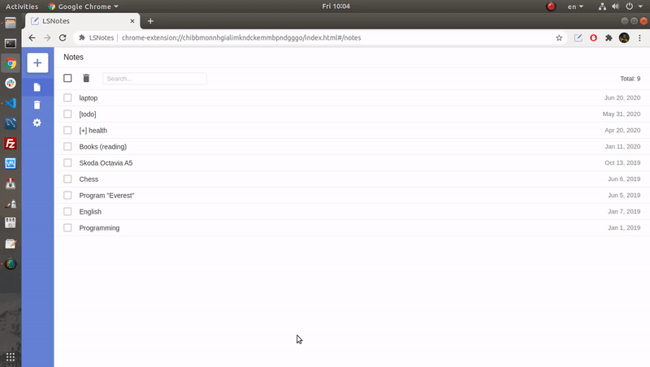

# LSNotes

Simple notes manager in a browser window. Uses Local Storage and provides export-import for a notes backup.

## Install

Until I didn't create Google Play account:
1. upload [archive](https://github.com/smokehill/lsnotes/archive/master.zip)
2. in Chrome go to the chrome://extensions and click "Load unpacked"